#  Android 界面布局实验

## Android布局实验

### 学习官方文档：

https://developer.android.google.cn/guide/topics/ui/declaring-layout.html

####  学习文档中关于ConstraintLayout, LinearLayout和

TableLayout的相关内容

## Android布局实验

#### 利用线性布局实现如下界面：

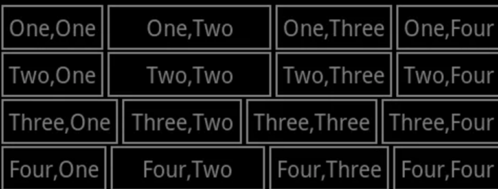

**实验小结：**android:orientation**  ：布局方向，将布局类型设置成垂直布局vertical 

​                                                            另外一种布局是水平布局

​                   **android:background** ：将背景设置成黑色

​                   每个**linearlayout**中包含4个**button**

​                   再将字符串放入**string.xml**，便于修改，虽然我们的这个代码好像不太用的到

实验代码：

    <?xml version="1.0" encoding="utf-8"?>
    <LinearLayout xmlns:android="http://schemas.android.com/apk/res/android"
        android:layout_width="match_parent"
        android:layout_height="match_parent"
        android:background="@color/colorBlack"
        android:orientation="vertical">
    <LinearLayout
        android:layout_width="match_parent"
        android:layout_height="wrap_content">
        <Button
            android:layout_width="wrap_content"
            android:layout_height="wrap_content"
            android:id="@+id/button1"
            android:text="@string/button11"/>
        <Button
            android:layout_width="wrap_content"
            android:layout_height="wrap_content"
            android:id="@+id/button2"
            android:layout_weight="1"
            android:text="@string/button12"/>
        <Button
            android:layout_width="wrap_content"
            android:layout_height="wrap_content"
            android:id="@+id/button3"
            android:text="@string/button13"/>
    
        <Button
            android:layout_width="wrap_content"
            android:layout_height="wrap_content"
            android:id="@+id/button4"
            android:text="@string/button14"/>
    </LinearLayout>
    <LinearLayout
        android:layout_width="match_parent"
        android:layout_height="wrap_content">
        <Button
            android:layout_width="wrap_content"
            android:layout_height="wrap_content"
            android:id="@+id/button11"
            android:text="@string/button21"/>
    
        <Button
            android:id="@id/button2"
            android:layout_width="wrap_content"
            android:layout_height="wrap_content"
            android:layout_weight="100"
            android:text="@string/button22" />
    
        <Button
            android:layout_width="wrap_content"
            android:layout_height="wrap_content"
            android:layout_weight="1"
            android:id="@id/button3"
            android:text="@string/button23" />
    
        <Button
            android:layout_width="wrap_content"
            android:layout_height="wrap_content"
            android:id="@id/button4"
            android:text="@string/button24"/>
    </LinearLayout>
    <LinearLayout
        android:layout_width="match_parent"
        android:layout_height="wrap_content">
        <Button
            android:layout_width="wrap_content"
            android:layout_height="wrap_content"
            android:layout_weight="1"
            android:id="@id/button1"
            android:text="@string/button31"/>
        <Button
            android:layout_width="wrap_content"
            android:layout_height="wrap_content"
            android:id="@id/button2"
            android:layout_weight="1"
            android:text="@string/button32"/>
        <Button
            android:layout_width="wrap_content"
            android:layout_height="wrap_content"
            android:layout_weight="1"
            android:id="@id/button3"
            android:text="@string/button33"/>
    
        <Button
            android:layout_width="wrap_content"
            android:layout_height="wrap_content"
            android:layout_weight="1"
            android:id="@id/button4"
            android:text="@string/button34"/>
    </LinearLayout>
    <LinearLayout
        android:layout_width="match_parent"
        android:layout_height="wrap_content">
        <Button
            android:layout_width="wrap_content"
            android:layout_height="wrap_content"
            android:id="@id/button1"
            android:text="@string/button41"/>
        <Button
            android:layout_width="wrap_content"
            android:layout_height="wrap_content"
            android:id="@id/button2"
            android:layout_weight="1"
            android:text="@string/button42"/>
        <Button
            android:layout_width="wrap_content"
            android:layout_height="wrap_content"
            android:id="@id/button3"
            android:text="@string/button43"/>
    
        <Button
            android:layout_width="wrap_content"
            android:layout_height="wrap_content"
            android:id="@id/button4"
            android:text="@string/button44"/>
    </LinearLayout>
    </LinearLayout>
color.xml

     <?xml version="1.0" encoding="utf-8"?>
    <resources>
    <color name="colorPrimary">#6200EE</color>
    <color name="colorPrimaryDark">#3700B3</color>
    <color name="colorAccent">#03DAC5</color>
    <color name="colorBlack">#000000</color>
    <color name="colorRed">#E80C0C</color>
    <color name="colorYellow">#ECDB6F</color>
    <color name="colorGreen">#90EC6F</color>
    <color name="colorBlue">#6F7CEC</color>
    <color name="colorViolet">#D316A4</color>
    </resources>

string.xml


    <resources>
    <string name="app_name">My Application</string>
    <string name="to" />
    <string name="subject" />
    <string name="message" />
    <string name="button11" > 1,1  </string>
    <string name="button12" > 1,2  </string>
    <string name="button13" > 1,3  </string>
    <string name="button14" > 1,4  </string>
    <string name="button21" > 2,1  </string>
    <string name="button22" > 2,2  </string>
    <string name="button23" > 2,3  </string>
    <string name="button24" > 2,4  </string>
    <string name="button31" > 3,1  </string>
    <string name="button32" > 3,2 </string>
    <string name="button33" > 3,3  </string>
    <string name="button34" > 3,4  </string>
    <string name="button41" > 4,1  </string>
    <string name="button42" > 4,2  </string>
    <string name="button43" > 4,3  </string>
    <string name="button44" > 4,4  </string>
    </resources>


实验截图

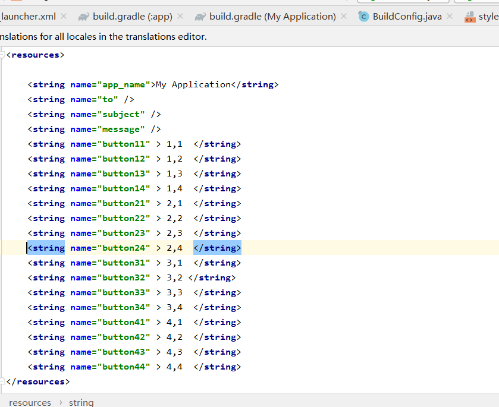

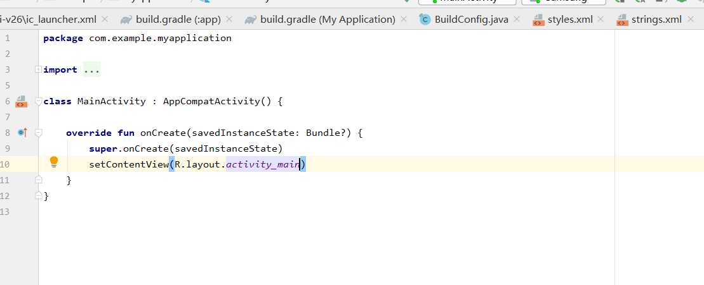

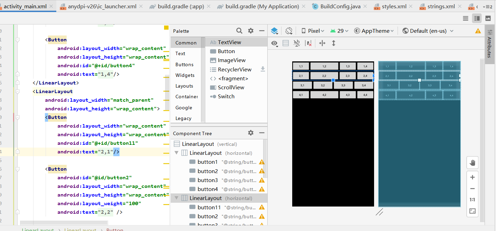

结果截图

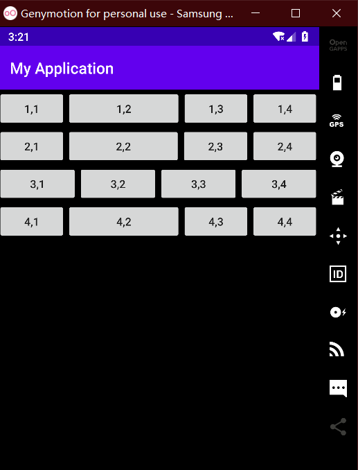

## Android布局实验

###  利用ConstraintLayout实现如下界面：

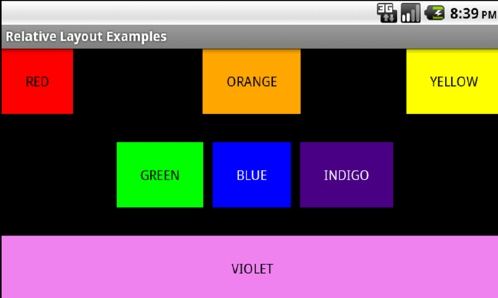

**实验小结：TextView中    **android:gravity**设置为center，文字内容居中。

​             **app:layout_constraintEnd_toEndOf**

​             **app:layout_constraintStart_toStartOf**

​             **app:layout_constraintTop_toTopOf**     如对控件 A 使用 `layout_constraintLeft_toRightOf = “@id/B“` 则表示 A 对左边边界对齐 B 对右边边界。用这几个来布局


**实验代码**

constraintlayout.xml

    <?xml version="1.0" encoding="utf-8"?>
    <androidx.constraintlayout.widget.ConstraintLayout xmlns:android="http://schemas.android.com/apk/res/android"
        xmlns:app="http://schemas.android.com/apk/res-auto"
        xmlns:tools="http://schemas.android.com/tools"
        android:layout_width="match_parent"
        android:layout_height="match_parent">
        <TextView
            android:id="@+id/textView1"
            android:layout_width="100dp"
            android:layout_height="100dp"
            android:background="@color/colorRed"
            android:gravity="center"
            android:text="@string/red"
            android:textColor="@color/colorBlack"
            app:layout_constraintStart_toStartOf="parent"
            app:layout_constraintTop_toTopOf="parent" />
    
        <TextView
            android:id="@+id/textView2"
            android:layout_width="100dp"
            android:layout_height="100dp"
            android:background="@android:color/holo_orange_dark"
            android:gravity="center"
            android:text="@string/orange"
            android:textColor="@color/colorBlack"
            app:layout_constraintEnd_toEndOf="parent"
            app:layout_constraintStart_toStartOf="parent"
            app:layout_constraintTop_toTopOf="parent" />
    
        <TextView
            android:id="@+id/textView3"
            android:layout_width="100dp"
            android:layout_height="100dp"
            android:background="@color/colorYellow"
            android:gravity="center"
            android:text="@string/yellow"
            android:textColor="@color/colorBlack"
            app:layout_constraintEnd_toEndOf="parent"
            app:layout_constraintTop_toTopOf="parent" />
    
        <TextView
            android:layout_width="100dp"
            android:layout_height="100dp"
            android:id="@+id/textView4"
            android:text="@string/blue"
            android:textColor="@color/colorBlack"
            android:gravity="center"
            android:background="@android:color/holo_blue_light"
            app:layout_constraintTop_toTopOf="parent"
            app:layout_constraintEnd_toEndOf="parent"
            app:layout_constraintStart_toStartOf="parent"
            app:layout_constraintBottom_toBottomOf="parent"
            />
        <TextView
            android:layout_width="100dp"
            android:layout_height="100dp"
            android:id="@+id/textView5"
            android:text="@string/green"
            android:textColor="@color/colorBlack"
            android:gravity="center"
            android:background="@color/colorGreen"
            app:layout_constraintTop_toTopOf="parent"
            app:layout_constraintEnd_toStartOf="@id/textView4"
            android:layout_marginEnd="20dp"
            android:layout_marginStart="20dp"
            app:layout_constraintBottom_toBottomOf="parent"
            />
        <TextView
            android:layout_width="100dp"
            android:layout_height="100dp"
            android:id="@+id/textView6"
            android:text="@string/indigo"
            android:textColor="@color/colorBlack"
            android:gravity="center"
            android:background="@color/colorBlue"
            app:layout_constraintTop_toTopOf="parent"
            app:layout_constraintStart_toEndOf="@id/textView4"
            android:layout_marginEnd="20dp"
            android:layout_marginStart="20dp"
            app:layout_constraintBottom_toBottomOf="parent"/>
    
        <TextView
            android:layout_width="match_parent"
            android:layout_height="100dp"
            android:text="@string/violet"
            android:textColor="@color/colorBlack"
            android:background="@color/colorViolet"
            android:gravity="center"
            app:layout_constraintBottom_toBottomOf="parent"
            />
    </androidx.constraintlayout.widget.ConstraintLayout>
colors.xml

```
<?xml version="1.0" encoding="utf-8"?>
<resources>

​```
<color name="colorPrimary">#6200EE</color>
<color name="colorPrimaryDark">#3700B3</color>
<color name="colorAccent">#03DAC5</color>
<color name="colorBlack">#000000</color>
<color name="colorRed">#E80C0C</color>
<color name="colorYellow">#ECDB6F</color>
<color name="colorGreen">#90EC6F</color>
<color name="colorBlue">#6F7CEC</color>
<color name="colorViolet">#D316A4</color>


</resources>
```

string.xml

```
<resources>
    <string name="app_name">My Application</string>
    <string name="to" />
    <string name="subject" />
    <string name="message" />
    <string name="red">Red</string>
    <string name="orange">ORANGE</string>
    <string name="yellow">YELLOW</string>
    <string name="blue">BLUE</string>
    <string name="green">GREEN</string>
    <string name="indigo">INDIGO</string>
    <string name="violet">VIOLET</string>

</resources>
```

**实验截图**：

预览图

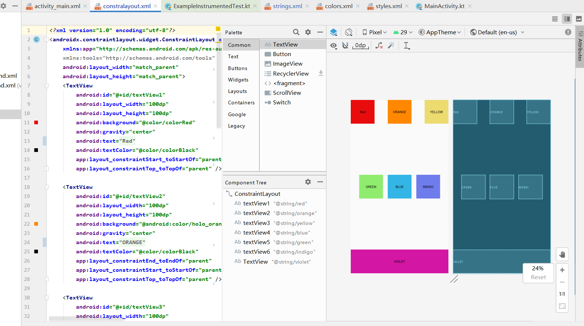

**实验结果：**

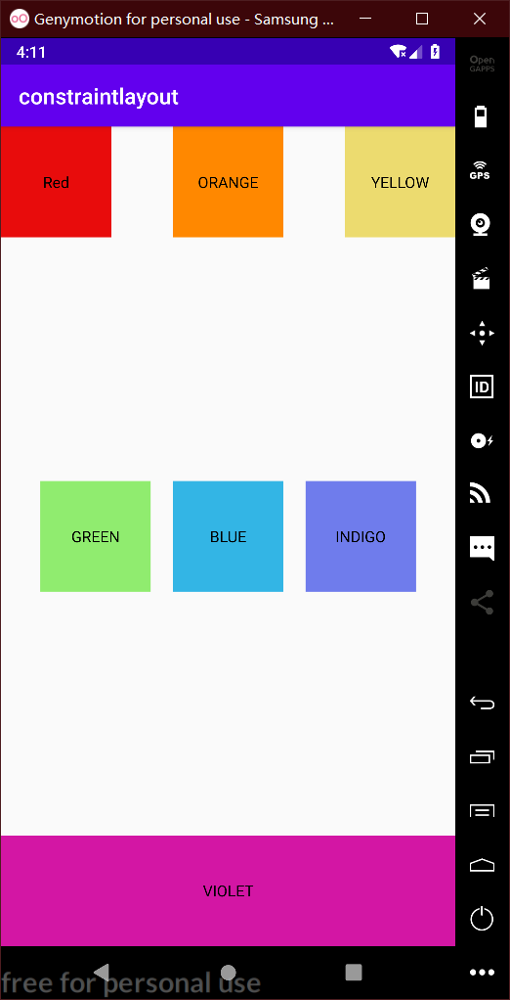

## Android布局实验

### 利用表格布局实现如下界面：

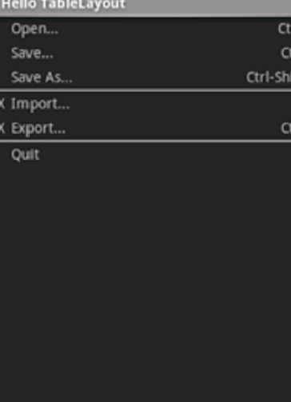

**实验小结：** 第一列只有“ ” 和“ x”  

​                    第二列和第三列**android:layout_weight="1"**会适配大小 

​                   **android:gravity="right"** 使文字靠右

**实验代码** :  

**tablelayout.xml**


    <?xml version="1.0" encoding="utf-8"?>
    <TableLayout xmlns:android="http://schemas.android.com/apk/res/android"
        xmlns:tools="http://schemas.android.com/tools"
        android:layout_width="match_parent" android:layout_height="match_parent"
        android:background="@android:color/background_dark"
        android:shrinkColumns="0"
        >
        <View android:id="@+id/top"
            android:layout_width="match_parent"
            android:layout_height="1dp"
            android:background="@color/colorgreen"
            ></View>
        <TableRow>
            <TextView
                android:id="@+id/text"
                android:text="@string/blank"
                android:textColor="@color/colorGray" />
            <TextView
                android:id="@+id/text12"
                android:gravity="left"
                android:layout_weight="1"
                android:text="@string/open"
                android:textColor="@color/colorGray" />
    <TextView
            android:id="@+id/text13"
            android:gravity="right"
            android:layout_weight="1"
            android:text="@string/ctrl_o"
            android:textColor="@color/colorGray" />
    </TableRow>
    <TableRow>
        <TextView
            android:id="@id/text"
            android:text="@string/blank"
            android:textColor="@color/colorGray" />
        <TextView
            android:id="@+id/text22"
            android:gravity="left"
            android:layout_weight="1"
            android:text="@string/save"
            android:textColor="@color/colorGray" />
    
        <TextView
            android:id="@+id/text"
            android:layout_weight="1"
            android:gravity="right"
            android:text="@string/ctrl_s"
            android:textColor="@color/colorGray"
            tools:ignore="DuplicateIds" />
    </TableRow>
    <TableRow>
        <TextView
            android:id="@id/text"
            android:text="@string/blank"
            android:textColor="@color/colorGray" />
        <TextView
            android:id="@+id/text32"
            android:gravity="left"
            android:layout_weight="1"
            android:text="@string/save_as"
            android:textColor="@color/colorGray" />
    
        <TextView
            android:id="@id/text33"
            android:layout_weight="1"
            android:gravity="right"
            android:text="@string/ctrl_shift_s"
            android:textColor="@color/colorGray"
            />
    </TableRow>
    
    <View android:id="@+id/line"
        android:layout_width="match_parent"
        android:layout_height="1dp"
        android:background="@color/colorgreen"
        ></View>
    
    <TableRow>
        <TextView
            android:id="@id/text"
            android:text="@string/x"
            android:textColor="@color/colorGray" />
        <TextView
            android:id="@id/text41"
            android:layout_weight="1"
            android:text="@string/imports"
            android:textColor="@color/colorGray" />
            </TableRow>
    <TableRow>
        <TextView
            android:id="@id/text"
            android:text="@string/x"
            android:textColor="@color/colorGray" />
        <TextView
            android:id="@+id/text52"
            android:layout_weight="1"
            android:text="@string/emport"
            android:textColor="@color/colorGray" />
    
        <TextView
            android:id="@+id/text53"
            android:layout_weight="1"
            android:gravity="right"
            android:text="@string/ctrl_e"
            android:textColor="@color/colorGray"
            />
    </TableRow>
    <View android:id="@id/line"
        android:layout_width="match_parent"
        android:layout_height="1dp"
        android:background="@color/colorgreen"
        />
    
    <TableRow>
        <TextView
            android:id="@id/text"
            android:text="@string/blank"
            android:textColor="@color/colorGray" />
        <TextView
            android:id="@+id/text6"
            android:layout_weight="1"
            android:text="@string/quit"
            android:textColor="@color/colorGray" />
            </TableRow>
    </TableLayout>

mainactivity


    package com.example.tablelayout
    
    import androidx.appcompat.app.AppCompatActivity
    import android.os.Bundle
    
    class MainActivity : AppCompatActivity() {
    override fun onCreate(savedInstanceState: Bundle?) {
        super.onCreate(savedInstanceState)
        setContentView(R.layout.tablelayout)
    }
    }


string.xml

    <resources>
        <string name="app_name">tablelayout</string>
    <string name="ctrl_o">Ctrl - O</string>
    <string name="blank">" "</string>
    <string name="open">opening</string>
    <string name="save">Save...</string>
    <string name="ctrl_s">Ctrl - S</string>
    <string name="save_as">Save as...</string>
    <string name="ctrl_shift_s">Ctrl - Shift - S</string>
    <string name="x">×</string>
    <string name="imports" >import</string>
    <string name="emport">Emport ....</string>
    <string name="ctrl_e">ctrl- E</string>
    <string name="quit">quit</string>
    </resources>
ids.xml

```
<?xml version="1.0" encoding="utf-8"?>
<resources>
    <item name="text33" type="id" />
    <item name="text41" type="id" />
    <item name="text42" type="id" />
    <item name="line" type="id"/>
</resources>
```

**实验截图**:

预览图

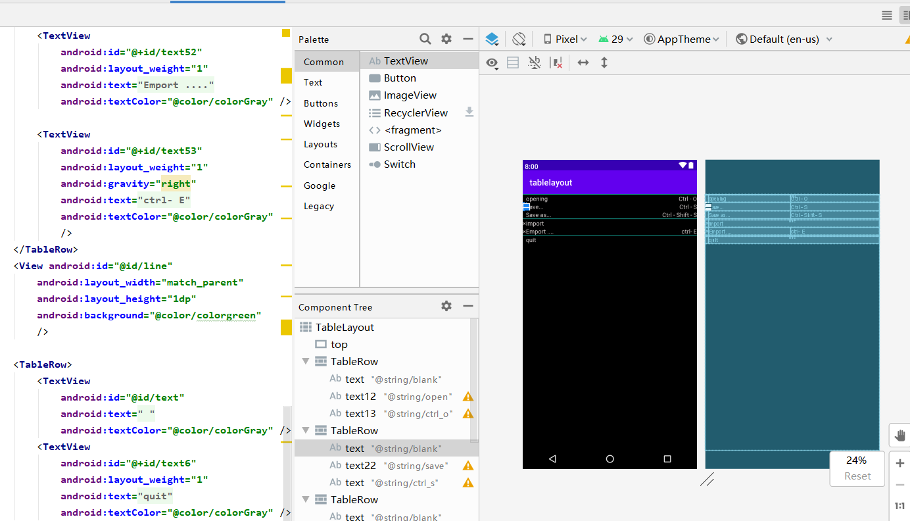

**实验结果：**


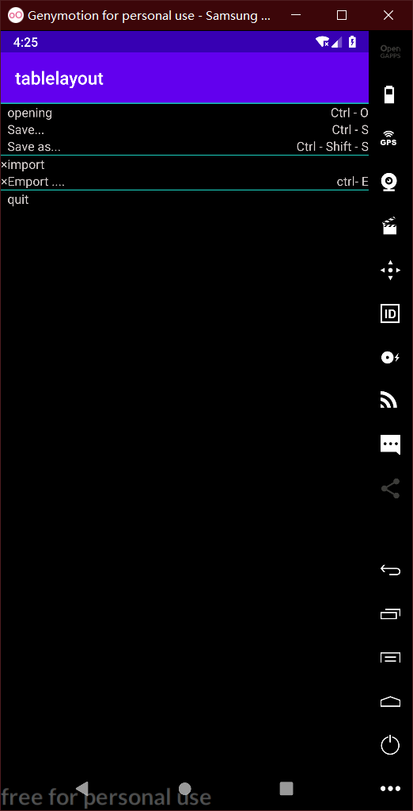

## 实验遇到的问题

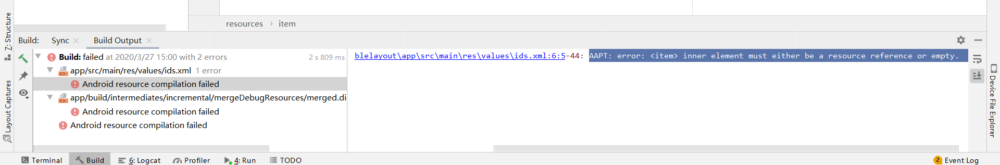

百度发现是

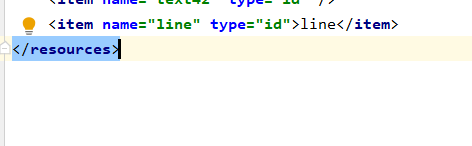

把line 后面哪些删掉改成这样久可以了

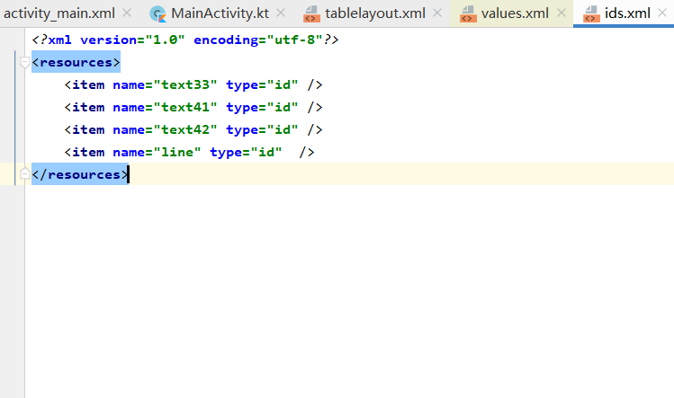

