# Android开发实验基础

## 安装Android studio

**Android Studio下载：**
  **http://android-studio.org/**
  **https://developer.android.google.cn/studio/**

开始安装

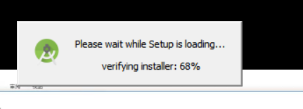

按照默认的一路安装

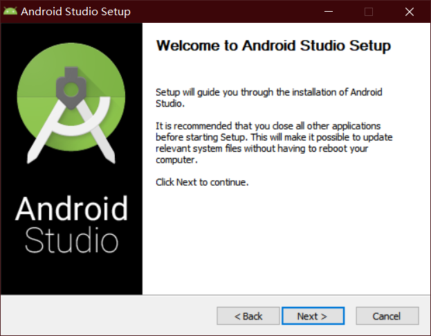

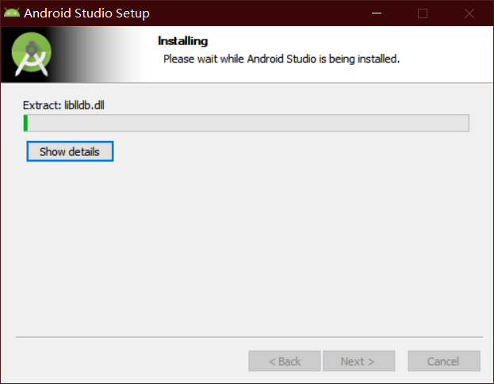

出现这个是因为没用安装SDK，把SDK安装然后配置一下，就可以用了

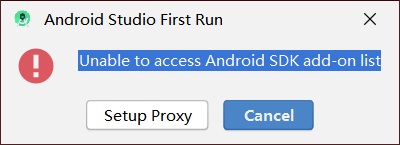

进入

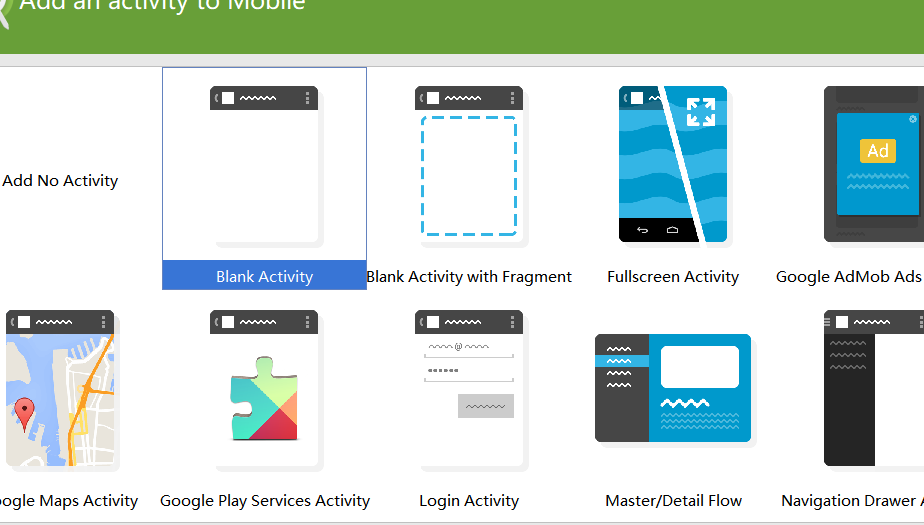

## 创建一个Android工程并同步到github

### 创建一个新项目

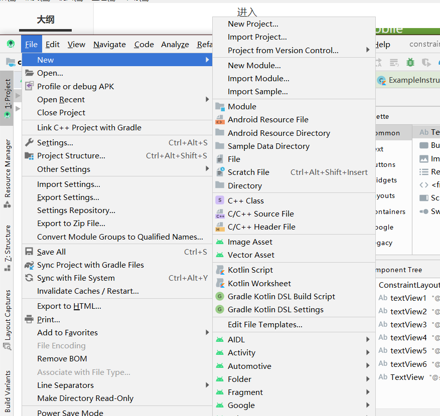

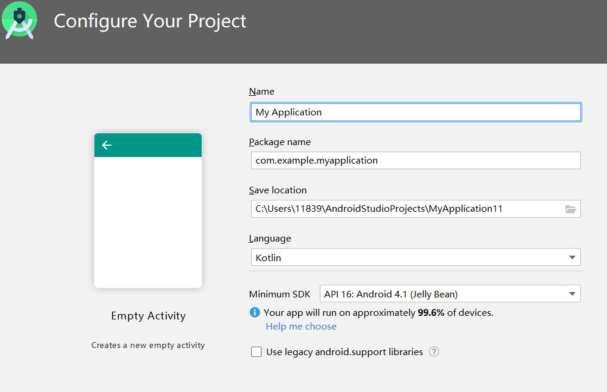

可以直接run

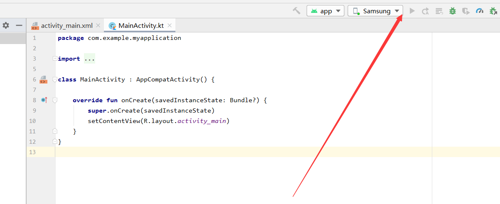

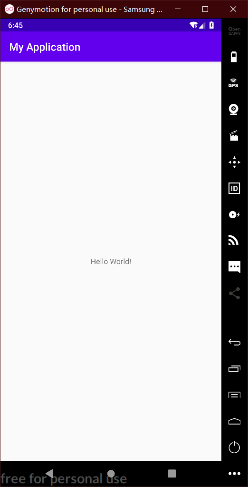

### 同步到github

**使用git工具**

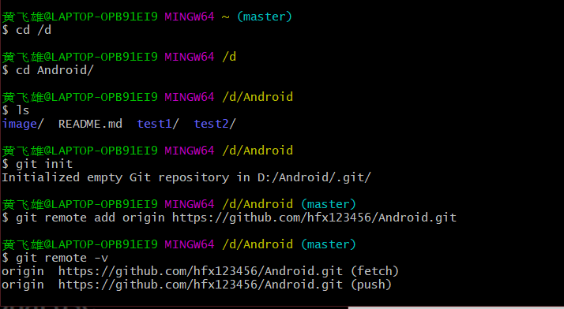

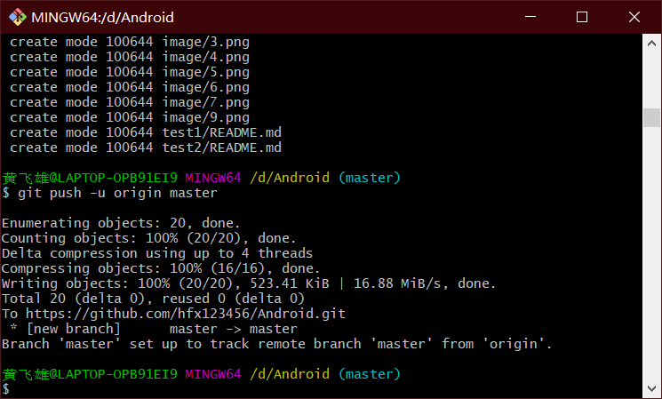

**好像Android studio可以直接上传到github上面去，我还没试过**

## 遇到的问题

**一个就是下载sdk**

**还有一个是我为了图方便下载了自带sdk版本的Android studio 。打开后连接genymotion需要下载插件，后来我就换了个版本，3.5版本的Android studio 不需要下载插件，可以直接识别genymotion**