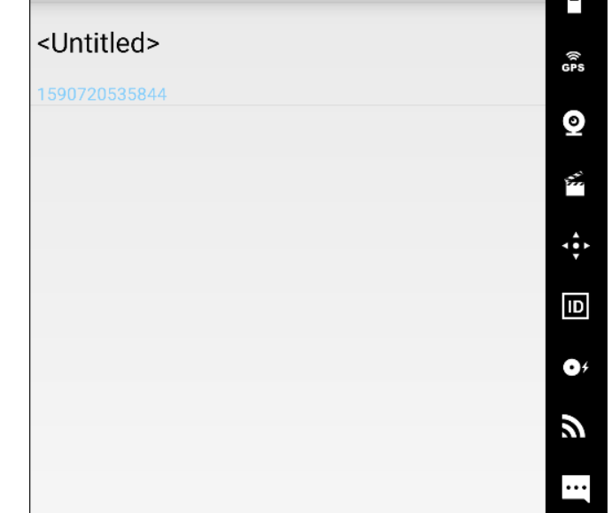

# NotePad笔记本应用

## 添加笔记时间戳

首先，先修改布局文件 添加显示时间的text view

```
<!--显示时间的textview-->
<TextView
    android:id="@+id/text_time"
    android:layout_width="match_parent"
    android:layout_height="wrap_content"
    android:textAppearance="?android:attr/textAppearanceSmall"
    android:paddingLeft="5dip"
    android:textColor="#87CEFA" />
    />
```

再查看数据库的结构，NotePadProvider.java中:


NotePad数据库已经存在时间信息。

**接着进行功能拓展**


要将时间显示，首先要在PROJECTION中定义显示的时间，原应用有两种时间，我选择修改时间作为显示的时间。

```
private static final String[] PROJECTION = new String[]{
        NotePad.Notes._ID, // 0
        NotePad.Notes.COLUMN_NAME_TITLE, // 1
        NotePad.Notes.COLUMN_NAME_MODIFICATION_DATE,//显示时间
        
};
```


在dataColumns，viewIDs中补充时间部分：

```
      String[] dataColumns = {
                NotePad.Notes.COLUMN_NAME_TITLE,
                NotePad.Notes.COLUMN_NAME_MODIFICATION_DATE  //显示时间
        };

        // The view IDs that will display the cursor columns, initialized to the TextView in
        // noteslist_item.xml
        int[] viewIDs = {
                android.R.id.text1,
                R.id.text_time
        };

```


但此时显示的是时间戳，而不是时间，所以要进行转换



接着进行数据的转化，把时间戳显示成时间

然后用dateTime替换now

```
   Long now = Long.valueOf(System.currentTimeMillis());
        Date date = new Date(now); //获取时间
        SimpleDateFormat format = new SimpleDateFormat("yyyy-MM-dd HH:mm:ss");//设置日期格式
        String dateTime = format.format(date);  //为获取当前系统时间
        // If the values map doesn't contain the creation date, sets the value to the current time.
        if (values.containsKey(NotePad.Notes.COLUMN_NAME_CREATE_DATE) == false) {
            values.put(NotePad.Notes.COLUMN_NAME_CREATE_DATE, dateTime);
        }

        // If the values map doesn't contain the modification date, sets the value to the current
        // time.
        if (values.containsKey(NotePad.Notes.COLUMN_NAME_MODIFICATION_DATE) == false) {
            values.put(NotePad.Notes.COLUMN_NAME_MODIFICATION_DATE, dateTime);
        }

```


最后在notelist获取当前时间

```
/**

 * 获取当前时间

 *

 * @return

 */

public static String getCurrentTime_Today() {

    SimpleDateFormat sdf = new SimpleDateFormat("yyyy-MM-dd HH:mm:ss");

    return sdf.format(new java.util.Date());

}
```


## 添加笔记查询功能

在list_options_menu.xml，添加一个搜索的item，搜索图标用安卓自带的图标，设为总是显示：

```
<!--搜索-->
<item
    android:id="@+id/menu_search"
    android:title="@string/menu_search"
    android:icon="@android:drawable/ic_search_category_default"//自带的图标库
    android:showAsAction="always">//设为总是显示
</item>
```

在onOptionsItemSelected的switch (item.getItemId())中添加对应menu_search的case：

```
//搜素
case R.id.menu_search:
    startActivity(new Intent(Intent.ACTION_SEARCH,getIntent().getData()));
    return true;
```

在layout中新建布局文件note_search_list.xml：

```
<?xml version="1.0" encoding="utf-8"?>
<LinearLayout xmlns:android="http://schemas.android.com/apk/res/android"
    android:orientation="vertical"
    android:layout_width="match_parent"
    android:layout_height="match_parent">

    <SearchView
        android:id="@+id/search_view"
        android:layout_width="match_parent"
        android:layout_height="wrap_content"
        android:iconifiedByDefault="false"
        android:queryHint="what you want ..."
        android:layout_alignParentTop="true">
    </SearchView>
    <ListView
        android:id="@android:id/list"
        android:layout_width="match_parent"
        android:layout_height="wrap_content">
    </ListView>
</LinearLayout>
```

对SearchView文本变化设置监听，NoteSearch除了要继承ListView外还要实现SearchView.OnQueryTextListener接口

首先定义一个数组来存放数据

```
private static final String[] PROJECTION = new String[] {
        NotePad.Notes._ID, // 0
        NotePad.Notes.COLUMN_NAME_TITLE, // 1

        NotePad.Notes.COLUMN_NAME_MODIFICATION_DATE //加入了修改时间的显示

};
```

获取intent，并且对search进行修改

```
protected void onCreate(Bundle savedInstanceState) {
    super.onCreate(savedInstanceState);
    setContentView(R.layout.note_search_list);
    //获取intent
    Intent intent = getIntent();
    if (intent.getData()==null){
        intent.setData(NotePad.Notes.CONTENT_URI);
    }

    getListView().setOnCreateContextMenuListener(this);

    SearchView searchview = (SearchView)findViewById(R.id.search_view);

    searchview.setOnQueryTextListener(NoteSearch.this);

}
```

实现相应的接口

```
/** 实现相应的接口 **/
@Override
public boolean onQueryTextSubmit(String query) {
    return false;
}
```

```

<!--添加搜索activity-->
<activity
    android:name=".NoteSearch"
    android:label="NoteSearch"
    >

    <intent-filter>
        <action android:name="android.intent.action.NoteSearch" />
        <action android:name="android.intent.action.SEARCH" />
        <action android:name="android.intent.action.SEARCH_LONG_PRESS" />
        <category android:name="android.intent.category.DEFAULT" />
        <data android:mimeType="vnd.android.cursor.dir/vnd.google.note" />
        <!--1.vnd.android.cursor.dir代表返回结果为多列数据-->
        <!--2.vnd.android.cursor.item 代表返回结果为单列数据-->
    </intent-filter>
</activity>
```

最后注册notesearch

```
<!--添加搜索activity-->
<activity
    android:name=".NoteSearch"
    android:label="NoteSearch"
    >

    <intent-filter>
        <action android:name="android.intent.action.NoteSearch" />
        <action android:name="android.intent.action.SEARCH" />
        <action android:name="android.intent.action.SEARCH_LONG_PRESS" />
        <category android:name="android.intent.category.DEFAULT" />
        <data android:mimeType="vnd.android.cursor.dir/vnd.google.note" />
        <!--1.vnd.android.cursor.dir代表返回结果为多列数据-->
        <!--2.vnd.android.cursor.item 代表返回结果为单列数据-->
    </intent-filter>
</activity>
```


完整代码

```
package com.example.android.notepad;

import android.app.ListActivity;
import android.content.ContentUris;
import android.content.Intent;
import android.database.Cursor;
import android.net.Uri;
import android.os.Bundle;
import android.view.View;
import android.widget.ListView;
import android.widget.SearchView;
import android.widget.SimpleCursorAdapter;

public class NoteSearch extends ListActivity implements SearchView.OnQueryTextListener {
    private static final String[] PROJECTION = new String[] {
            NotePad.Notes._ID, // 0
            NotePad.Notes.COLUMN_NAME_TITLE, // 1

            NotePad.Notes.COLUMN_NAME_MODIFICATION_DATE //加入了修改时间的显示

    };

    @Override
    protected void onCreate(Bundle savedInstanceState) {
        super.onCreate(savedInstanceState);
        setContentView(R.layout.note_search_list);
        //获取intent
        Intent intent = getIntent();
        if (intent.getData()==null){
            intent.setData(NotePad.Notes.CONTENT_URI);
        }

        getListView().setOnCreateContextMenuListener(this);

        SearchView searchview = (SearchView)findViewById(R.id.search_view);

        searchview.setOnQueryTextListener(NoteSearch.this);

    }
    /** 实现相应的接口 **/
    @Override
    public boolean onQueryTextSubmit(String query) {
        return false;
    }
    @Override
    public boolean onQueryTextChange(String newText) {
        String selection = NotePad.Notes.COLUMN_NAME_TITLE + " Like ? ";//查询条件
        String[] selectionArgs = { "%"+newText+"%" };////查询条件参数，配合selection参数使用,%通配多个字符
        Cursor cursor = managedQuery(
                getIntent().getData(),             // 用于ContentProvider查询的URI，从这个URI获取数据
                PROJECTION,                       // 用于标识uri中有哪些columns需要包含在返回的Cursor对象中
                selection,                        // 作为查询的过滤参数
                selectionArgs,                     // 查询条件参数，配合selection参数使用
                NotePad.Notes.DEFAULT_SORT_ORDER  // 排序
        );
        //适配器，将游标中的数据映射到布局文件中的TextView控件或者ImageView控件中
        String[] dataColumns = { NotePad.Notes.COLUMN_NAME_TITLE ,  NotePad.Notes.COLUMN_NAME_MODIFICATION_DATE };
        int[] viewIDs = { android.R.id.text1 , R.id.text_time };
        SimpleCursorAdapter adapter = new SimpleCursorAdapter(
                this,
                R.layout.noteslist_item,  //布局文件
                cursor,
                dataColumns,
                viewIDs
        );
        setListAdapter(adapter);
        return true;
    }
    @Override
    protected void onListItemClick(ListView l, View v, int position, long id) {
        // Constructs a new URI from the incoming URI and the row ID
        Uri uri = ContentUris.withAppendedId(getIntent().getData(), id);
        // Gets the action from the incoming Intent
        String action = getIntent().getAction();
        // Handles requests for note data
        if (Intent.ACTION_PICK.equals(action) || Intent.ACTION_GET_CONTENT.equals(action)) {
            // Sets the result to return to the component that called this Activity. The
            // result contains the new URI
            setResult(RESULT_OK, new Intent().setData(uri));
        } else {
            // Sends out an Intent to start an Activity that can handle ACTION_EDIT. The
            // Intent's data is the note ID URI. The effect is to call NoteEdit.
            startActivity(new Intent(Intent.ACTION_EDIT, uri));
        }
    }
}
```

实验结果：


